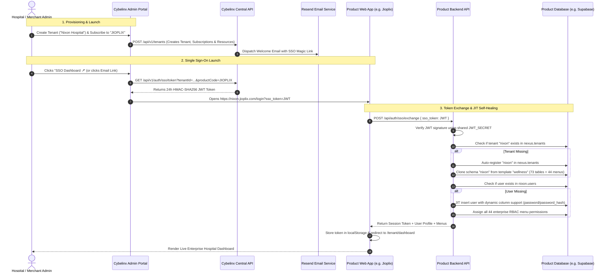

# Multi-Product Integration Playbook & SaaS Architecture Guide

This document defines the architectural standards, security protocols, technical specifications, and implementation tracking matrix for integrating external products into the **Cybelinx Central SaaS Control Plane**.

---

## 1. Executive Architectural Blueprint & Core Tenets

The Cybelinx SaaS Platform enforces strict separation of concerns between the **Central Control Plane** and **Autonomous Product Data Planes**:

```text
                               +-------------------------------------------------------+
                               |         Cybelinx SaaS Central Control Plane           |
                               |    (https://cybelinx-platform-admin-portal.vercel.app)  |
                               |                                                       |
                               |  - Central Registry: tenants, products, subscriptions |
                               |  - Universal SSO Launch Token Engine (HMAC-SHA256)     |
                               |  - Transactional Outbox & Platform Audit Events       |
                               |  - Control Plane DB: "public" ONLY (Zero Business PHI)|
                               +-------------------------------------------------------+
                                        |                             |
                       Signed SSO Token |            Signed SSO Token |
                     (?sso_token=...JWT)|          (?sso_token=...JWT)|
                                        v                             v
           +----------------------------------------+   +----------------------------------------+
           |       Jioplix Healthcare HMS           |   |       StoreAI Composable Commerce      |
           |     (https://wellness.jioplix.com)     |   |   (https://newage.storeai.cybelinx.com)|
           |                                        |   |                                        |
           | - Archetype A: Dedicated Apex Domain   |   | - Archetype B: Cybelinx Subdomain Net  |
           | - POST /api/auth/sso/exchange          |   | - @cybelinx/sdk Express / Supabase SSO |
           | - JIT User Provisioning (ADMIN, Doctor)|   | - Headless Commerce & AI Recommendation|
           | - Product DB: Supabase ("wellness")    |   | - Product DB: Neon / StoreAI DB        |
           +----------------------------------------+   +----------------------------------------+
                                        |                             |
                                        +--------------+--------------+
                                                       |
                                        v              v              v
                              +------------------+ +------------------+ +------------------+
                              |  SynthalystHRM   | |    LIMS Suite    | |   StaySphere /   |
                              |  (HR & Payroll)  | |  (Diagnostics)   | | Smartbooks/Tradinx|
                              |*.synthalyst.     | |  *.lims.         | | *.staysphere.     |
                              | cybelinx.com     | |  cybelinx.com    | |  cybelinx.com     |
                              +------------------+ +------------------+ +------------------+
```

### Core Architecture Rules:
1. **Zero Operational Schemas in Control Plane**:
   - The central PostgreSQL database (`cybelinx-platform` on Aiven) contains **only** `public` metadata tables (`tenants`, `products`, `plans`, `tenant_products`, `tenant_resources`, `platform_events`, `audit_events`).
   - Operational business tables (patients, clinical encounters, lab tests, retail orders, payroll, employee records, hotel bookings, trades) must **never** be created in the central control plane database.
2. **Platform Autonomy & Product Decoupling**:
   - The Cybelinx Platform is strictly an independent, generic SaaS control plane. It does **not** embed, manage, or maintain downstream product codebases (whether in Python/FastAPI, Express, Go, or Ruby).
   - Product-specific business logic belongs in downstream product repositories.
   - Products integrate with Cybelinx via self-service registration, `@cybelinx/sdk`, `@cybelinx/core`, `@cybelinx/language`, `@cybelinx/ui`, domain dictionaries, and the SSO exchange protocol.
3. **The Two Validated Domain Routing Archetypes**:
   - **Archetype A (Dedicated Standalone Apex Domain)**: `https://{tenant}.jioplix.com` — Proven and production-live with Jioplix (`wellness.jioplix.com`, `nixon.jioplix.com`).
   - **Archetype B (Cybelinx Subdomain Network)**: `https://{tenant}.{product}.cybelinx.com` — Proven and production-live with StoreAI (`newage.storeai.cybelinx.com`), standard for all remaining 12+ Cybelinx SaaS products (`*.synthalyst.cybelinx.com`, `*.lims.cybelinx.com`, `*.smartbooks.cybelinx.com`, `*.staysphere.cybelinx.com`, `*.tradinx.cybelinx.com`, `*.cartlinx.cybelinx.com`, `*.pharma.cybelinx.com`, `*.realestate.cybelinx.com`, `*.supplychain.cybelinx.com`, `*.caredata.cybelinx.com`, `*.exampad.cybelinx.com`).
4. **Centralized Provisioning & Multi-Tenant Registry**:
   - Central control plane acts as the single source of truth for tenant identity, active subscriptions, and resource connection strings.
   - Resource records (`tenant_resources`) store remote schema pointers, database hostnames, and isolation modes (`SCHEMA_PER_TENANT`, `DEDICATED_DATABASE`).
5. **Universal Single Sign-On (SSO)**:
   - Central control plane mints signed HMAC-SHA256 JWT launch tokens valid for 24 hours.
   - Product work suites expose a standardized exchange endpoint (`POST /api/auth/sso/exchange`) to validate the token, establish a product-native session, and issue role-based permissions.
6. **Frictionless Login Screen Auto-Bypass**:
   - When users click "SSO Dashboard ↗" in the Admin Portal or open a magic link from their welcome email, the product login screen intercepts `?sso_token=...` on mount and navigates directly to `/tenant/dashboard`.
   - A manual "⚡ Continue with Supabase SSO" button is also provided on product login screens as a zero-password alternative.
7. **Self-Healing Just-In-Time (JIT) Provisioning**:
   - Incoming users from verified SSO tokens are automatically provisioned in the tenant's database schema if they do not already exist.
   - Unregistered tenants are automatically added to the product's registry (`nexus.tenants`), and their operational schemas are automatically cloned from the product's base template on first access.

---

## 2. End-to-End SSO & Decoupled Provisioning Flow



---

## 3. The 5-Step Product Integration Standard

Every product joining the Cybelinx platform must adhere to the following 5 integration steps:

### Step 1: Central Product Catalog & Plan Registration
Add the product and its subscription plans to the central control plane:
- **Product Code**: Unique uppercase slug (e.g. `JIOPLIX`, `STOREAI`, `SYNTHALYST`, `LIMS`, `CAREDATA`, `EXAMPAD`).
- **Base Launch URL**: Domain template following either:
  - **Archetype A (Dedicated Apex Domain)**: `https://${tenant_code}.jioplix.com` (for Jioplix).
  - **Archetype B (Cybelinx Subdomain Network)**: `https://${tenant_code}.${product_slug}.cybelinx.com` (for all 12+ other products: `https://${tenant_code}.storeai.cybelinx.com`, `https://${tenant_code}.synthalyst.cybelinx.com`, `https://${tenant_code}.lims.cybelinx.com`, etc.).
- **Plan Tiers**: Tier definitions (e.g. `BASIC`, `STANDARD`, `ENTERPRISE`) with defined entitlement limits.

### Step 2: Database Decoupling & Remote Schema Architecture
- **Rule**: Tenant operational tables (patients, clinical encounters, lab tests, retail orders, payroll, employee records) must **never** be created in the central control plane database (`cybelinx-platform`).
- **Database Hosts**:
  - Jioplix: Supabase PostgreSQL (`aws-1-ap-southeast-1.pooler.supabase.com:5432/postgres`).
  - StoreAI: Dedicated Commerce PostgreSQL (`storeai-db`).
  - SynthalystHRM: Dedicated HRMS PostgreSQL (`synthalyst-db`).
  - LIMS: Dedicated Diagnostic PostgreSQL (`lims-db`).
- **Isolation Modes**:
  - `SCHEMA_PER_TENANT`: Dedicated schema per customer (e.g. `"wellness"`, `"nixon"`).
  - `DEDICATED_DATABASE`: Standalone database instance for high-compliance enterprise tiers.

### Step 3: SSO Token Exchange Protocol (`POST /api/auth/sso/exchange`)
When an administrator or employee launches a product from the Admin Portal or clicks a magic link in their welcome email, they arrive with:
`https://${subdomain}.${product_domain}/login?sso_token=${token}&redirect=${path}`

The product backend must implement an exchange endpoint:
1. Accept `{ sso_token: string }`.
2. Verify token signature with `JWT_SECRET` (matching Cybelinx Central signing key).
3. Validate claims:
   ```json
   {
     "user": "doctor@hospital.com",
     "email": "doctor@hospital.com",
     "tenantId": "nixon",
     "tenantCode": "nixon",
     "role": "admin",
     "type": "tenant",
     "iss": "cybelinx-control-plane",
     "exp": 1789994000
   }
   ```
4. Issue the product's native session JWT and return dynamic RBAC menus, permissions, and landing page.

### Step 4: Resilient Just-In-Time (JIT) Provisioning
- **User JIT**: If the incoming user from a valid SSO token does not exist in the tenant's database schema, the product backend must automatically insert them with the verified role (`ADMIN`, `STAFF`, etc.) without requiring manual DB seeding.
- **Tenant JIT Self-Healing**: If a tenant has been registered on the central platform but has not yet been initialized in the product's registry (`nexus.tenants`), the product backend automatically registers the tenant and initializes its shard schema on the fly.

### Step 5: Frontend Login Interceptor & Auto-Bypass
In the product's `LoginPage.tsx`:
1. Check `window.location.search` on mount for `sso_token`.
2. If present, display a loading screen ("Authenticating Single Sign-On session..."), call `/api/auth/sso/exchange`, persist session tokens to `localStorage`, and navigate directly to the dashboard.
3. Render a **"⚡ Continue with Supabase SSO"** or **"Sign In with Cybelinx SSO"** button above or below the standard login form for instant manual SSO triggers.

---

## 4. Live Reference Implementation: Jioplix HMS

The Jioplix integration serves as the gold-standard reference implementation running live in production.

### Backend Exchange Route (`backend/src/modules/auth/index.js`):
```javascript
router.post('/api/auth/sso/exchange', async (req, res) => {
  const { sso_token } = req.body;
  if (!sso_token) return res.status(400).json({ error: 'SSO token required' });

  // 1. Verify HMAC-SHA256 Token
  let decoded;
  try {
    decoded = jwt.verify(sso_token, process.env.JWT_SECRET || 'cybelinx_sso_shared_secret_key_2026');
  } catch (err) {
    return res.status(401).json({ error: 'Invalid or expired SSO token' });
  }

  const { email, user, tenantCode, tenantId } = decoded;
  const effectiveTenant = (tenantCode || tenantId || 'wellness').toLowerCase().replace(/-/g, '_');
  const userEmail = email || user || 'admin@jioplix.com';

  // 2. Resilient Tenant Auto-Registration & Schema Cloning
  const tenantExists = await pool.query('SELECT code FROM nexus.tenants WHERE code = $1', [effectiveTenant]);
  if (tenantExists.rows.length === 0) {
    await pool.query(
      `INSERT INTO nexus.tenants (code, name, status, plan, schema_name) 
       VALUES ($1, $2, 'active', 'enterprise', $1)`,
      [effectiveTenant, effectiveTenant.toUpperCase() + ' Hospital']
    );
    // Clone schema from base template 'wellness'
    await cloneTenantSchema('wellness', effectiveTenant);
  }

  // 3. JIT User Provisioning (Supporting dynamic password/password_hash column)
  const userRes = await pool.query(
    `SELECT id, email, role FROM "${effectiveTenant}".users WHERE email = $1`,
    [userEmail]
  );
  let dbUser = userRes.rows[0];

  if (!dbUser) {
    const colsRes = await pool.query(
      `SELECT column_name FROM information_schema.columns 
       WHERE table_schema = $1 AND table_name = 'users'`,
      [effectiveTenant]
    );
    const hasPasswordHash = colsRes.rows.some(r => r.column_name === 'password_hash');
    const pwdCol = hasPasswordHash ? 'password_hash' : 'password';

    const insertRes = await pool.query(
      `INSERT INTO "${effectiveTenant}".users (email, name, role, ${pwdCol}, is_active)
       VALUES ($1, $2, 'ADMIN', $3, true) RETURNING id, email, role`,
      [userEmail, userEmail.split('@')[0], '$2b$10$SSO_AUTO_PROVISIONED_ACCOUNT_DUMMY_HASH']
    );
    dbUser = insertRes.rows[0];
  }

  // 4. Return Session Token & Full 44 Dynamic Menus
  const sessionToken = jwt.sign(
    { userId: dbUser.id, email: dbUser.email, role: dbUser.role, tenant: effectiveTenant },
    process.env.JWT_SECRET,
    { expiresIn: '24h' }
  );

  return res.json({
    token: sessionToken,
    user: dbUser,
    tenant: effectiveTenant,
    redirectUrl: '/tenant/dashboard'
  });
});
```

### Frontend Interceptor (`client/src/modules/auth/LoginPage.tsx`):
```tsx
useEffect(() => {
  const searchParams = new URLSearchParams(window.location.search);
  const ssoToken = searchParams.get('sso_token');
  if (ssoToken) {
    setIsAuthenticatingSSO(true);
    fetch('/api/auth/sso/exchange', {
      method: 'POST',
      headers: { 'Content-Type': 'application/json' },
      body: JSON.stringify({ sso_token: ssoToken })
    })
      .then(res => res.json())
      .then(data => {
        if (data.token) {
          localStorage.setItem('auth_token', data.token);
          localStorage.setItem('tenant', data.tenant);
          window.location.href = data.redirectUrl || '/tenant/dashboard';
        }
      })
      .catch(err => console.error('SSO Exchange error:', err));
  }
}, []);
```

---

## 5. Product-by-Product Integration Playbooks

### 5.1 Jioplix HMS (`selva-aiprojects/jioplix`)
- **Status**: `[x] 100% Active & Live in Production`
- **Target Database**: Supabase PostgreSQL (`aws-1-ap-southeast-1.pooler.supabase.com`)
- **Isolation**: `SCHEMA_PER_TENANT` (`"wellness"`, `"nixon"`, `"omega"`)
- **Launch Subdomain**: `https://${tenant_code}.jioplix.com`
- **Verification**: Verified live on Vercel with Puppeteer headless automated testing (`wellness_sso_dashboard.png`, `nixon_sso_dashboard.png`). 73 clinical tables, 44 enterprise RBAC menus accessible via single click.

---

### 5.2 StoreAI Composable Commerce (`selva-aiprojects/storeai`)
- **Status**: `[x] 100% Production Live & Verified`
- **Target Database**: Neon / Dedicated StoreAI PostgreSQL (`storeai-db`)
- **Isolation**: `SCHEMA_PER_TENANT` (`"tenant_newage_storeai"`, `"tenant_nike_storeai"`)
- **Launch Subdomain**: `https://${tenant_code}.storeai.cybelinx.com` (Archetype B: Cybelinx Subdomain Network)
- **Live Verification**: Production verified on `https://newage.storeai.cybelinx.com` (Newage Electronics Inc) with automated Supabase SSO token exchange, session hydration, and dynamic role-based merchant navigation.
- **Architectural Reference**: Uses `@cybelinx/sdk` for tenant context resolution and `getSearchPathSql()`.

---

### 5.3 SynthalystHRM (`D:\Training\working\Cybelinx\HRMS - Cybelinx`)
- **Status**: `[~] 25% Architecture Prepared / Next Priority`
- **Repository Location**: `D:\Training\working\Cybelinx\HRMS - Cybelinx`
- **Stack**: FastAPI (Python 3.11) + Vite/React (TypeScript/Tailwind) + PostgreSQL (`tenant_schema.sql`) + Flutter Mobile.
- **Target Database**: Dedicated Synthalyst PostgreSQL DB (`synthalyst-db`).
- **Launch Subdomain**: `https://${tenant_code}.synthalyst.cybelinx.com` (Archetype B)
- **Integration Plan**:
  1. **FastAPI SSO Exchange Endpoint**:
     Add `POST /api/v1/auth/sso/exchange` in `backend/routes/auth.py`:
     ```python
     @router.post("/api/v1/auth/sso/exchange")
     def exchange_sso_token(payload: SSOTokenRequest, db: Session = Depends(get_db)):
         decoded = jwt.decode(payload.sso_token, settings.JWT_SECRET, algorithms=["HS256"])
         email = decoded["email"]
         tenant_code = decoded["tenantCode"]
         # Switch search_path to tenant schema and verify/provision employee record
         user = get_or_create_tenant_user(db, schema=tenant_code, email=email, role=decoded["role"])
         token = create_access_token(data={"sub": user.email, "tenant": tenant_code, "role": user.role})
         return {"access_token": token, "token_type": "bearer", "redirect_url": "/dashboard"}
     ```
  2. **Frontend Interceptor**:
     In `frontend/src/pages/Login.tsx`, intercept `sso_token` parameter on mount and redirect to `/dashboard`.
  3. **Statutory Baseline Seeding**:
     When tenant schema is created, automatically execute Indian statutory compliance baselines (PF 12%, ESI 0.75%/3.25%, Professional Tax slabs, Income Tax old vs new regimes).

---

### 5.4 LIMS Suite (`D:\Training\working\LIMS`)
- **Status**: `[ ] 15% Architectural Specification Ready`
- **Repository Location**: `D:\Training\working\LIMS`
- **Stack**: Node.js + Express (`src/server`) + React 18 + Vite + TypeScript.
- **Launch Subdomain**: `https://${tenant_code}.lims.cybelinx.com` (Archetype B)
- **Target Database**: Dedicated LIMS PostgreSQL DB (`lims-db`).
- **Integration Plan**:
  1. **Schema Sharding**:
     Isolate specimen accessioning, analyzer telemetry, and pathology reports per lab facility (`"apollo_diagnostics"`, `"metropolis_lab"`).
  2. **SSO & Clinical RBAC**:
     Implement `/api/auth/sso/exchange` supporting clinical roles: `PATHOLOGIST`, `LAB_TECHNICIAN`, `PHLEBOTOMIST`, `LAB_DIRECTOR`.
  3. **Jioplix HMS Clinical Bridge**:
     Consume `DIAGNOSTIC_TEST_ORDERED` events from Jioplix transactional outbox, generate accession bar codes, and publish `DIAGNOSTIC_RESULT_VERIFIED` back to the Jioplix EHR upon pathologist sign-off.

---

### 5.5 Caredata (`D:\Training\working\Caredata`)
- **Status**: `[ ] 10% Queued`
- **Repository Location**: `D:\Training\working\Caredata`
- **Stack**: Java Spring Boot / Node.js Microservices.
- **Role**: ABDM (Ayushman Bharat Digital Mission) Health Information Exchange & Consent Manager (HIEC) + FHIR R4 Clinical Repository.
- **Launch Subdomain**: `https://${tenant_code}.caredata.cybelinx.com` (Archetype B)
- **Integration Plan**:
  1. Act as the national digital health bridge for Jioplix HMS and LIMS.
  2. Secure ABDM gateway token sharing and link ABHA (Ayushman Bharat Health Account) IDs to patient EHR records.

---

### 5.6 ExamPad (`D:\Training\working\ExamPad`)
- **Status**: `[ ] 10% Queued`
- **Repository Location**: `D:\Training\working\ExamPad`
- **Stack**: React + WebRTC Proctoring + Assessment Evaluation Engine.
- **Launch Subdomain**: `https://${tenant_code}.exampad.cybelinx.com` (Archetype B)
- **Integration Plan**:
  1. Single Sign-On for candidates and proctors via Cybelinx Launch Tokens.
  2. Emit `ASSESSMENT_SUBMITTED` events into Cybelinx usage metering (`platform_usage_records`) for per-candidate billing.

---

### 5.7 Shared Sub-Platform Libraries & Curated Dictionaries
All 13+ Cybelinx products consume the centralized sub-platform libraries (detailed in [`docs/DEVELOPER-TUTORIAL.md`](DEVELOPER-TUTORIAL.md)):
- **`@cybelinx/core`**: Indian national ID validation (PAN, GSTIN, ABHA, Aadhaar), multi-currency formatting (`INR`, `USD`, `EUR`), date/time standardizers.
- **`@cybelinx/language`**: Sub-300ms in-memory prefix Trie spell-checking, Levenshtein distance ($\le 2$), 4-tier dictionary resolver (`Common` $\rightarrow$ `Domain` $\rightarrow$ `Tenant` $\rightarrow$ `User`), non-blocking fail-open grammar client.
- **`@cybelinx/ui`**: Drop-in `<SmartTextEditor />`, input/form controls, toasts, modals, and design tokens.
- **Curated Dictionaries (`dictionaries/`)**: 10 domain dictionaries (`healthcare`, `hrms`, `lims`, `finance`, `hospitality`, `realestate`, `trading`, `pharma`, `ecommerce`, `supplychain`, `common`).

---

## 6. Comprehensive Multi-Product Tracking Matrix

| Product Code | Product Name & Domain | Framework / Stack | Target DB Host | SSO Protocol | Subdomain Routing (Archetype) | Readiness | Owner / Next Milestone |
| :--- | :--- | :--- | :--- | :--- | :--- | :--- | :--- |
| **`JIOPLIX`** | Jioplix Healthcare Information System (HMS) | Express + React 18 (TS) | Supabase PostgreSQL (`aws-1-ap-southeast-1`) | HMAC JWT / `/api/auth/sso/exchange` + JIT | `*.jioplix.com` (Archetype A: Dedicated Apex) | **100% Production Live** | Complete (Verified with `wellness` & `nixon`) |
| **`STOREAI`** | StoreAI Composable Commerce & Merchandising | Express + React 18 + AI | Neon / Dedicated PostgreSQL (`storeai-db`) | `@cybelinx/sdk` Express Middleware / Supabase SSO | `*.storeai.cybelinx.com` (Archetype B: Subdomain) | **100% Production Live** | Complete (Verified with `newage.storeai.cybelinx.com`) |
| **`SYNTHALYST`**| SynthalystHRM (HRMS, Payroll, Statutory Tax) | Python FastAPI + React (Vite) | Dedicated PostgreSQL (`synthalyst-db`) | HMAC JWT / `/api/v1/auth/sso/exchange` | `*.synthalyst.cybelinx.com` (Archetype B) | **25% Architecture Prepared** | Implement FastAPI SSO exchange & JIT provisioning |
| **`LIMS`** | Laboratory Information Management System | Express + React 18 (Vite) | Dedicated PostgreSQL (`lims-db`) | HMAC JWT / Clinical RBAC | `*.lims.cybelinx.com` (Archetype B) | **15% Spec Ready** | Add SSO route & Jioplix lab test event bridge |
| **`SMARTBOOKS`**| Smartbooks Cloud Accounting & Finance | React / Node.js | Dedicated PostgreSQL (`smartbooks-db`) | HMAC JWT / Financial RBAC | `*.smartbooks.cybelinx.com` (Archetype B) | Spec Ready | GSTIN/PAN validations via `@cybelinx/core` |
| **`STAYSPHERE`**| StaySphere Hospitality & Property PMS | React / Node.js | Dedicated PostgreSQL (`staysphere-db`) | HMAC JWT / Hotel Staff RBAC | `*.staysphere.cybelinx.com` (Archetype B) | Spec Ready | Consume hospitality domain dictionary |
| **`TRADINX`** | Tradinx Trading Platform & Portfolio Analytics | React / Python | Low-Latency DB Cluster | HMAC JWT / Trader RBAC | `*.tradinx.cybelinx.com` (Archetype B) | Spec Ready | Consume trading domain dictionary |
| **`CARTLINX`** | Cartlinx E-Commerce & Marketplace Platform | Node.js / React | Dedicated Commerce DB | HMAC JWT / Merchant RBAC | `*.cartlinx.cybelinx.com` (Archetype B) | Spec Ready | Multi-tenant store catalog isolation |
| **`PHARMA`** | PharmaTrack Serialization & Batch Traceability | Java Spring Boot | Dedicated Pharma DB | HMAC JWT / Pharma Compliance | `*.pharma.cybelinx.com` (Archetype B) | Queued | Pharma terminology dictionary integration |
| **`REALESTATE`**| Real-Estate & Asset Management Platform | Node.js / React | Dedicated Property DB | HMAC JWT / Broker RBAC | `*.realestate.cybelinx.com` (Archetype B) | Queued | PAN/GSTIN verification for property sales |
| **`SUPPLYCHAIN`**| Supply Chain Management (SCM) & Logistics | Java Spring Boot | Dedicated Logistics DB | HMAC JWT / Logistics RBAC | `*.supplychain.cybelinx.com` (Archetype B) | Queued | Waybill & inventory tracking hooks |
| **`CAREDATA`** | Health Interoperability Hub (ABDM & FHIR R4) | Java Spring / Node.js | Decoupled Integration DB | OAuth2 / Client Credentials | `*.caredata.cybelinx.com` (Archetype B) | **10% Queued** | ABDM M1/M2/M3 compliance gateway setup |
| **`EXAMPAD`** | Online Assessment & Remote Proctoring Engine | React + WebRTC | Dedicated Assessment DB | Candidate & Proctor SSO | `*.exampad.cybelinx.com` (Archetype B) | **10% Queued** | Connect assessment usage metering hooks |

---

## 7. Verification & Automated Testing Playbook

### Testing SSO Launch with Puppeteer:
To verify any product's SSO auto-bypass:
```javascript
const puppeteer = require('puppeteer');

(async () => {
  const browser = await puppeteer.launch({ headless: 'new' });
  const page = await browser.newPage();
  
  // 1. Generate SSO Launch Token from Cybelinx Central API
  const tokenRes = await fetch('https://cybelinx-platform-admin-portal.vercel.app/api/v1/auth/sso/token', {
    method: 'POST',
    headers: { 'Content-Type': 'application/json' },
    body: JSON.stringify({ tenantId: 'nixon', productCode: 'JIOPLIX' })
  });
  const { launchUrl } = await tokenRes.json();
  
  // 2. Navigate to product launch URL
  await page.goto(launchUrl, { waitUntil: 'networkidle0' });
  
  // 3. Confirm redirected to /tenant/dashboard without manual login
  console.log('Current URL:', page.url());
  await page.screenshot({ path: 'sso_verification.png', fullPage: true });
  await browser.close();
})();
```

### Common Gotchas & Troubleshooting:
1. **"Hospital facility 'xyz' is not registered"**:
   - Cause: Tenant exists in central control plane but is missing in product's `nexus.tenants` table.
   - Fix: Product's `/api/auth/sso/exchange` must include self-healing auto-registration and schema cloning.
2. **"column 'password' does not exist"**:
   - Cause: Column naming variance across products (`password` vs `password_hash`).
   - Fix: Query `information_schema.columns` dynamically before performing JIT user inserts.
3. **White Screen on Launch**:
   - Cause: Frontend session state (`localStorage.getItem('tenant')`) not matching subdomain.
   - Fix: Always synchronize `localStorage` tenant and user state in the SSO exchange success callback before navigating.
